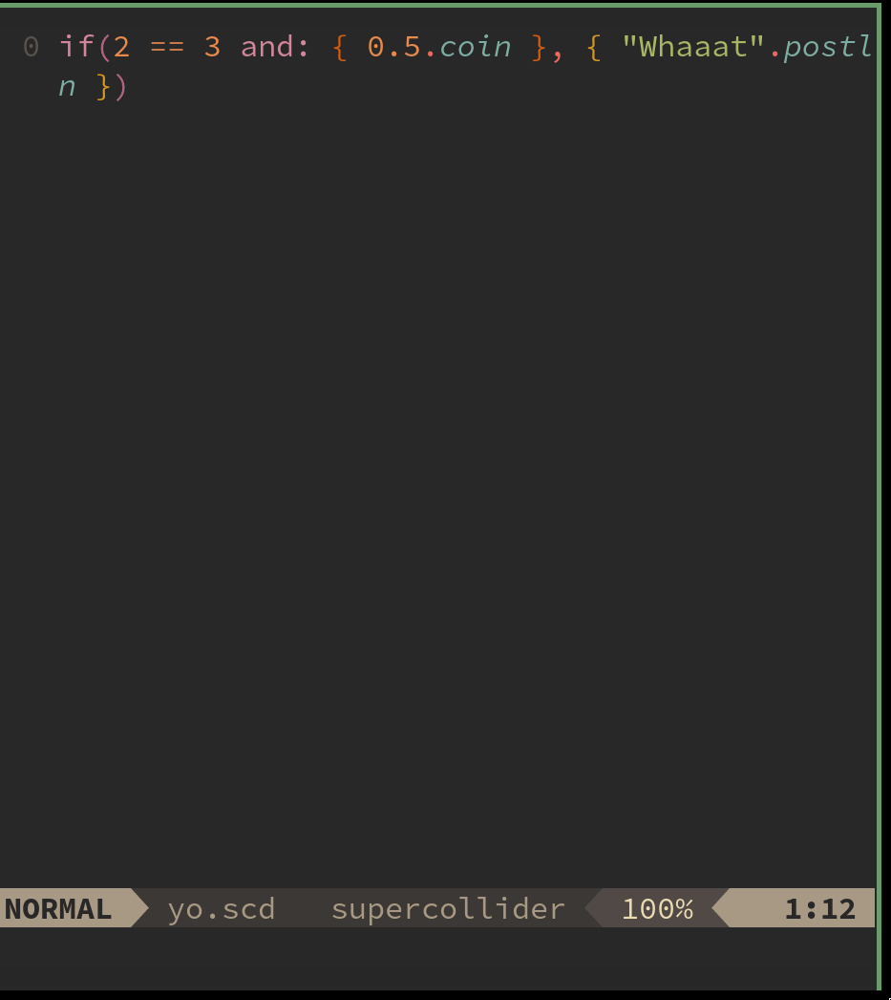

# fzf-sc



Use the power of [fzf](https://github.com/junegunn/fzf) to get the best out of [SuperCollider](https://supercollider:github::o/):

Fuzzy search basically anything in SuperCollider and execute SuperCollider code with the result of that search.

## Requirements

- [nvim-fzf](https://github.com/vijaymarupudi/nvim-fzf)(recommended) or [fzf.vim](https://github.com/junegunn/fzf.vim)
- [scnvim](https://github.com/davidgranstrom/scnvim)
- Nvim >= v0.5

## Installation

### packer.nvim
```lua
use {
	'madskjeldgaard/fzf-sc',
	config = function()
		require'fzf-sc'.setup({ search_plugin = "nvim-fzf", })
	end,
	requires = {
		'vijaymarupudi/nvim-fzf',
		'davidgranstrom/scnvim'
	}
}
```

### vim-plug
For vim-plug users, add this to your init.vim:

`Plug 'madskjeldgaard/fzf-sc'`

Then run `:PlugInstall`.

## Setup

Somewhere in your config file for neovim, add `lua require'fzf-sc'.setup()` if you're using `init.vim` or `require'fzf-sc'.setup()` for init.lua.

### Configuration

fzf-sc may be configured by supplying a table to the setup function in a lua file:

```lua
require'fzf-sc'.setup({
	-- Set to "nvim-fzf" if you have that plugin installed
	search_plugin = "fzf.vim" 
})
```

## Available commands
`:FzfSC`

Fuzzy search the fuzzy searchers. Gets list of all fuzzy search commands. Choose one and execute it.

To see the rest, type `:FzfSC ` on the command line and hit `tab` to autocomplete the available commands.

## Make your own fuzzy searcher

Making your own fuzzy searcher is fairly simple. You need two things: Some supercollider code that generates an array, some supercollider code that takes the result of your choice in the fuzzy finder and does something with that knowledge. Here is an example of getting all quarks as input and then installing the chosen item in the return code. The return code is a string where `%s` is replaced with the result of the fuzzy search, eg in the example below it will be the name of the quark the user chooses.

```lua
local sc_code = [[Quarks.fetchDirectory; Quarks.all.collect{|q| q.name}]];
local supercollider_return_code = "Quarks.install(\"%s\");";

require"fzf-sc".fzf_sc_eval(sc_code, supercollider_return_code)
```
